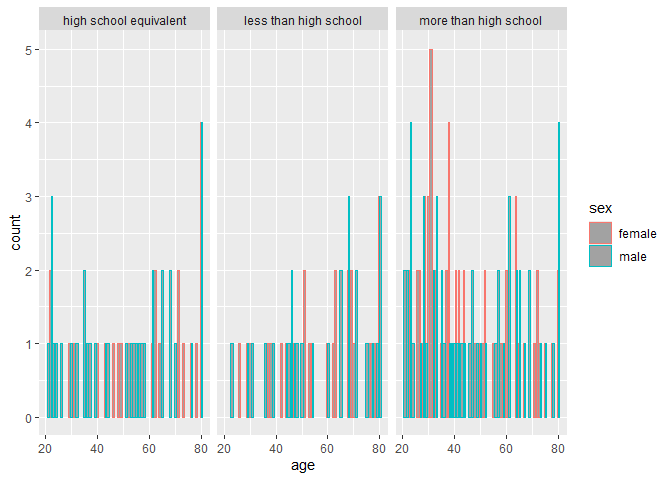
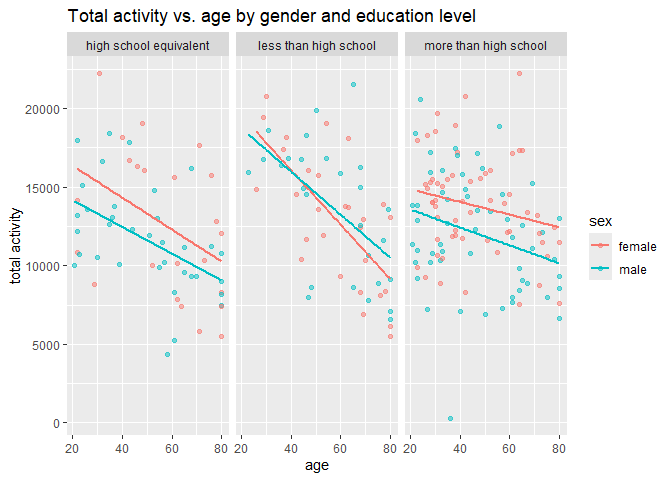

p8105_hw3_zw2975
================
Zhiyu Wei
2024-10-14

## Problem 1

``` r
# Import data
library(p8105.datasets) 
data("ny_noaa")
```

#### short descirption of the dataset:

The `ny_noaa` dataset has variables `id`, `date`, `prcp`, `snow`,`snwd`,
`tamx`, and `tmin`.

This dataset has 2595176 rows and 7 columns.

Missing date should not impact the analysis result drastically since
there are already too many missing values for `tmin`, `tmax`, `snow`,
and `snwd`.

#### Clean ny_noaa

``` r
# make dates cleaner
ny_noaa <- ny_noaa %>%
mutate(year = year(date), month = month(date), day = day(date))

# character to numeric, integer to numeric
ny_noaa <- ny_noaa %>%
  mutate(tmin = as.numeric(tmin)) %>%
  mutate(tmax= as.numeric (tmax)) %>%
  mutate(snow = as.numeric(snow)) %>%
  mutate(snwd = as.numeric(snwd)) %>%
  mutate(prcp = as.numeric(prcp))


# relocate the variables and rename them
ny_noaa <- ny_noaa %>%
  relocate(year, month, day) %>%
  rename(precip = prcp, snowfall = snow, snowdepth = snwd) %>%
  relocate(id)


# commonly observed value for snowfall
ggplot(ny_noaa, aes(x = snowfall)) + 
  geom_histogram() +
  labs (title = "snow fall distribution",
        x = "snow fall (mm)",
        y = "count in observation") 
```

    ## `stat_bin()` using `bins = 30`. Pick better value with `binwidth`.

<!-- --> \#####
According to the histogram of snowfall, the most commonly observed value
for snowfall is 0 mm.

#### panel plots

``` r
# in January
ny_noaa|>
  filter(!is.na (tmax)) |> #no need to include na obs
  filter(month == 1) |>
  ggplot(aes(x = year, y= tmax )) +
  labs(title = "January max temperature",
       ylab = "Temperature (in tenths)",
       xlab = "year") +
  facet_wrap(~id)
```

<!-- -->

#### panel plots 2

``` r
# takes a long time the process the data, need to get rid of NAs
ny_noaa2 <- ny_noaa |>
  filter(!is.na(tmax), !is.na(tmin))

ggplot(ny_noaa2, aes(x = tmax)) +
  geom_density(fill = "blue", alpha = 0.5) +
  ggtitle("Density Plot for max temperature") +
  xlab("tmax") +
  ylab("Density")
```

<!-- -->

``` r
# Density plot for tmin
ggplot(ny_noaa2, aes(x = tmin)) +
  geom_density(fill = "red", alpha = 0.5) +
  ggtitle("Density Plot for minimum temperature") +
  xlab("tmin") +
  ylab("Density")
```

<!-- -->

``` r
# density plot for both
ggplot(ny_noaa2) +
  geom_density(aes(x = tmax, fill = "tmax"), alpha = 0.5) +
  geom_density(aes(x = tmin, fill = "tmin"), alpha = 0.5) +
  scale_fill_manual(values = c("tmax" = "blue", "tmin" = "red")) +
  ggtitle("Combined Density Plot for tmax and tmin") +
  xlab("Temperature") +
  ylab("Density")
```

<!-- -->

## Problem 2

``` r
acceler = read.csv("./data/nhanes_accel.csv")
demog = read.csv("./data/nhanes_covar.csv")
```

#### data cleaning

``` r
# column names for the demographic dataset on 4th row
colnames(demog)<-demog[4,]

# get rid of useless rows
demog <- demog[5:254,]

# clean names 
demog<-janitor::clean_names(demog)
acceler <- janitor::clean_names(acceler)

demog <- demog |>
 mutate(sex = if_else(sex == 1, "male",
                      if_else( sex == 2, "female",
                      NA_character_)))|>
          mutate(education = if_else(education == 1,"less than high school" ,
                                     if_else(education == 2, "high school equivalent",
                                     if_else(education == 3, "more than high school", NA_character_))))
                  
# get rid of missing demographic data
demog <- demog |>
  na.omit()
  
# change acceler dataset "seqn" to a character variable
acceler <- acceler |>
  mutate(seqn = as.character(seqn))

# merge 2 datasets
nhanes <- inner_join (demog, acceler, by = "seqn")

# get rid of people under 21
nhanes <- nhanes |>
  filter(age >= 21)


# age needs to be numeric
nhanes <- nhanes |>
  mutate(age = as.numeric(age))
```

#### table for number of men and women

``` r
# sex as rows, education level as columns
table(nhanes$sex, nhanes$education)
```

    ##         
    ##          high school equivalent less than high school more than high school
    ##   female                     23                    28                    59
    ##   male                       35                    27                    56

#### visualization of age distibution

``` r
nhanes |>
  ggplot(aes(x = age)) +
  geom_bar(aes(color = sex),position = "dodge", alpha = .5) +
   facet_wrap(~education) 
```

<!-- --> \#####
Comment From the table, we can see that the dataset have more
participants who received education more than high school level. For
male, there are more participants who received high school equivalent
education compared to female. The age distribution graph also reflects
on the numbers from the table. The more than high school education
category has the most observations and participants who age younger tend
to fall into this education level. The age distribution for less than
high school and high school equivalent education levels have very
similar.

#### total activity against age

``` r
# new variable: total activity
nhanes <- nhanes |>
mutate(total_activity = (rowSums(nhanes[, 6:ncol(nhanes)], na.rm = TRUE)))
```

``` r
ggplot(nhanes, aes(x = age, y = total_activity)) +
geom_point(aes(color = sex), alpha = .5)+
  geom_smooth(method = "lm", se=FALSE, aes(color = sex)) +
  facet_grid(.~education) +
  labs(
    title = "Total activity vs. age by gender and education level",
    x = "age",
    y = "total activity",
    color = "sex") # I want more readable x axis numbers
```

    ## `geom_smooth()` using formula = 'y ~ x'

<!-- -->

##### Comment

Same as what we observed in the previous graphs, this scatter plot also
shows more participants falling into the more than high school education
level. However, the total activity of participants across the 3
education level does not seem to have big difference. There is one very
obvious outlier for more than high school education level, which is a
male participant who almost have 0 total activity minutes.

When we look at the trend lines, both female and male tend to have a
negative trend of age vs. total activity time and they have very similar
slope.

#### 3 panel plot

``` r
# step 1: pivot longer 

long =nhanes |>
  pivot_longer (
    "min1":"min1440",
    names_to = "min",
    values_to = "activity") |>
  select(seqn, sex, min, activity,education )

# step 2: mutate the min variable to make it numeric

long <- long |>
  mutate(min = as.numeric(gsub("min", "", min)))

# step 3: plot the 3-panel plot

long |>
  ggplot(aes (x = min, y = activity, color = sex))+
  geom_point(alpha = 0.05) + # increase the opacity of points to make the lines stand out
  geom_smooth(se = FALSE, linewidth= 2) +
  theme(legend.position = "bottom") +
  labs(title = "24 hrs activity by education levels",
       x = "minute (over 24 hrs)") +
  facet_grid(.~education)
```

    ## `geom_smooth()` using method = 'gam' and formula = 'y ~ s(x, bs = "cs")'

<!-- -->
\##### comment For every education level, the line all appears to be
declining and increasing then declining to reflect a person’s activity
level during the 24 hrs period. During the middle of the day, which is
around 500 minutes, the smooth trend line roughly reaches its maximum
since it is around 10 am in the morning. When the line reaches somewhere
over 1000 minutes, it starts declining, reflecting the end of work
hours.

## Problem 3

``` r
jan2020 = read.csv("./data/citibike/Jan 2020 Citi.csv")

jan2024 = read.csv("./data/citibike/Jan 2024 Citi.csv")

july2020 = read.csv("./data/citibike/July 2020 Citi.csv")

july2024 = read.csv("./data/citibike/July 2024 Citi.csv")
```

##### description of datasets

The 4 Citibike datasets contain number of observations reflecting on the
number of rides for each combination of year and month.

All of them have the exact same number of variables, which is
`ncol(jan2020)`, with the same names: `ride_id`, `rideable_type`,
`weekdays`, `duration`, `start_station_name`, `end_station_name`, and
`member_casual`.

In order to easily distinguish between the month and year for the
datasets after appending them, I will create 2 variables, year and
month, for each dataset before the merge.

#### Clean datasets

``` r
# Make variables to distinguish the dates
jan2020 <- jan2020|>
  mutate(year = 2020) |>
  mutate(month = "Jan")


july2020 <- july2020|>
  mutate(year = 2020) |>
  mutate(month = "July")

jan2024 <- jan2024|>
  mutate(year = 2024) |>
  mutate(month = "Jan")

july2024 <- jan2024|>
  mutate(year = 2024) |>
  mutate(month = "July")

# Combine datasets
citibike = rbind(jan2020, july2020, jan2024, july2024)
```

##### data description

Right now, all the datasets are combined together with 2 newly added
variables `year` and `month` to help distinguish when the observation
was from.

The combined dataset `citibike` has `ncol(citibike)` columns and
`nrow(citibike)` rows.

#### table and most popular stations

``` r
# make table, moth as row, year as column, separate members

# first method
table(citibike$month, citibike$year, citibike$member_casual)
```

    ## , ,  = casual
    ## 
    ##       
    ##         2020  2024
    ##   Jan    984  2108
    ##   July  5637  2108
    ## 
    ## , ,  = member
    ## 
    ##       
    ##         2020  2024
    ##   Jan  11436 16753
    ##   July 15411 16753

``` r
# second method
citibike |>
  group_by(year, month,member_casual) |>
  summarize(number_of_rides = n())|>
  knitr::kable()
```

    ## `summarise()` has grouped output by 'year', 'month'. You can override using the
    ## `.groups` argument.

| year | month | member_casual | number_of_rides |
|-----:|:------|:--------------|----------------:|
| 2020 | Jan   | casual        |             984 |
| 2020 | Jan   | member        |           11436 |
| 2020 | July  | casual        |            5637 |
| 2020 | July  | member        |           15411 |
| 2024 | Jan   | casual        |            2108 |
| 2024 | Jan   | member        |           16753 |
| 2024 | July  | casual        |            2108 |
| 2024 | July  | member        |           16753 |

``` r
# 5 most popular starting stations for July 2024
july2024 |>
  group_by(start_station_name) |>
  summarize(number_of_rides = n()) |>
  arrange(desc(number_of_rides))|>
  head(n = 5)
```

    ## # A tibble: 5 × 2
    ##   start_station_name    number_of_rides
    ##   <chr>                           <int>
    ## 1 W 21 St & 6 Ave                    90
    ## 2 Broadway & W 25 St                 77
    ## 3 E 17 St & Broadway                 68
    ## 4 W 31 St & 7 Ave                    67
    ## 5 Lafayette St & E 8 St              62

##### comment

According to the table, members tend to ride way more than non-members
for all 4 combinations of year and month.

For both members and non-members, the number of rides kept going up
until the January of 2024 and stayed the same after that.

#### Plot

``` r
# step 1: make a median duration dataset
median_duration = 
  citibike |>
  group_by(year, weekdays, month) |>
  summarise(median_duration = median(duration, na.rm = TRUE))
```

    ## `summarise()` has grouped output by 'year', 'weekdays'. You can override using
    ## the `.groups` argument.

``` r
# step 2: change year to factor to make better plot
median_duration <- median_duration |>
  mutate(year = as.factor(year))

# step 3: plot
  ggplot(median_duration, aes(x = factor (weekdays, levels = c( "Sunday", "Monday", "Tuesday", "Wednesday", "Thursday", "Friday", "Saturday")), y = median_duration, fill = year))+
  geom_bar(stat = "identity", position = "dodge" )+
  facet_wrap (~ month) +
  theme(legend.position = "bottom")+
  labs(title = "comparison of ride median duration by weekday, month, and year",
      x = "weekdays",
      y = "ride median duration in minutes")
```

<!-- -->

#### Impact of month, membership status, and bike type

``` r
# step 1: filter out year 2024 data
# step 2: plot using filtered data
# plot for non-members
non_member = 
citibike |>
  filter(year == 2024, member_casual == "casual") |>
ggplot(aes(x = duration, color = month))+
  geom_histogram(alpha = 0.2, position =  "dodge") +
  labs(title = "non-members' rides",
    x = "ride duration (mins)" ) +
  facet_grid(.~rideable_type)+
  theme(legend.position="none")

# plot for members
member = 
citibike |>
  filter(year == 2024, member_casual == "member") |>
ggplot(aes(x = duration, color = month))+
  geom_histogram(alpha = 0.2, position =  "dodge") +
  labs(title = "members' rides",
    x = "ride duration (mins)" ,
       color = "month") +
  facet_grid(.~rideable_type)

# patch them together
non_member + member
```

    ## `stat_bin()` using `bins = 30`. Pick better value with `binwidth`.
    ## `stat_bin()` using `bins = 30`. Pick better value with `binwidth`.

<!-- -->

##### Comment

For both non-members and members, the ride for electric bike has a
higher time compared to classic bikes. The distribution for all 4
comparisons are sharply right-skewed. Interestingly, members tend to
ride more classic bike compared to non-members.

The duration of rides in January are much higher for both members and
non-members.
